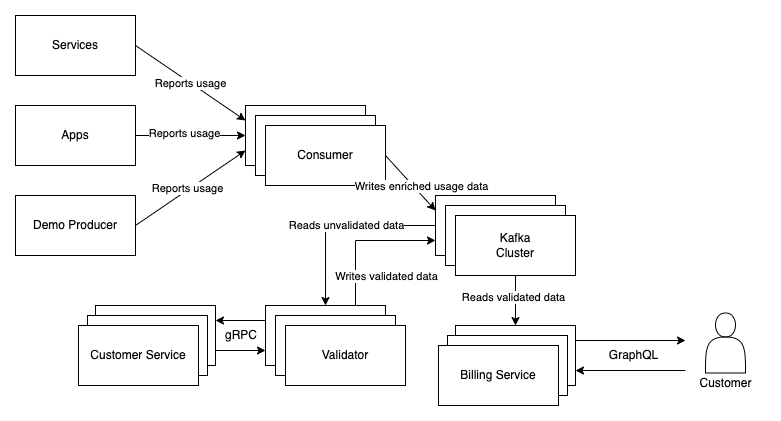

# WIP: Metered billing at scale
POC of higly scalable and resilient metered billing

## Flowchart

## Notes
* Don't forget to implement authN/authZ
* Consider the context and trade-offs (e.g. consuming usage reports and validation could be executed in a single step, which would reduce storage but increase latency)
* Have fun